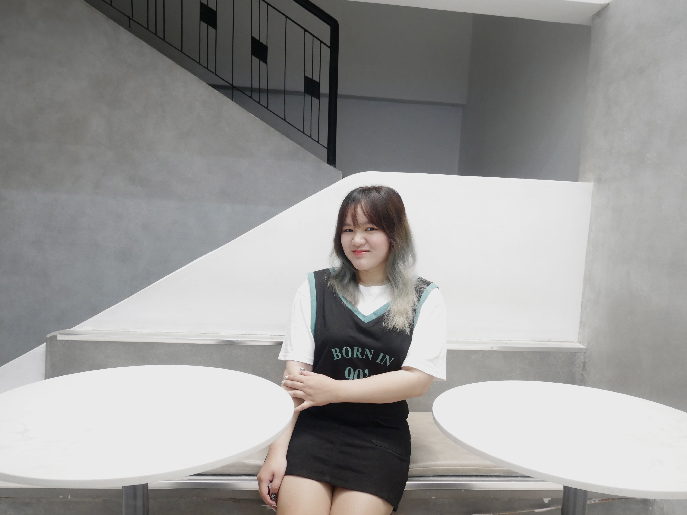

```{r setup, include=FALSE}
knitr::opts_chunk$set(echo = TRUE)
```

## Introduction to Me!
<div style="display: flex; align-items: center; gap: 20px;">
  <div style="flex: 1;"> Welcome to my page! I’m Eirlys Vo (you can find the pronunciation using Google Translate!) and I'm from Vietnam. My passion lies in Data Science—uncovering insights through data, using a variety of tools, and telling compelling stories through visualizations. If you share similar interests or want to collaborate on a project, feel free to connect with me on [LinkedIn](https://www.linkedin.com/in/phiquyvo/)! Besides, I'm a huge fan of K-POP (but not BTS or BlackPink) so if you are a fan too, please please please connect!! If you're not, just connect and have a talk!</div>
  <div style="flex: 1;">  </div>
</div>

### 1. Academic Background
University of Cincinnati:

- Bachelor of Science in Business Analytics
- Bachelor of Business Administration in Information Systems
- Certificate in Computer Science

### 2. Professional Background
I did a co-op as Business Analytics for RWI Logistics in Spring 2023, which was a great experience! Mostly I created interactive visualizations and dashboard to assist the Sales team tracking our business performance and for leadership team to track the stragetic goals. 

Currently, I'm looking for internship in data related positions for next semester. I hope I will get one soon!

### 3. Experience with R
I have self-learned and continuously practiced R Programming through doing practices and projects. The most recent project using R that I have done is Data Analysis of Coursera Dataset. You can view more about the project [here.](http://rpubs.com/ezishr/coursera-analysis)

Mostly, I use R to do the following:

- Data mining
- Data cleansing
- Data analysis
- Data Visualization
- Forecasting Multivariate regression

If you are interested in doing projects using R, I'm more than excited to join!

### 4. Experience with other analytic software
**Python**

I also use Python as second programming language to do the data analysis projects. The recent project I have done using Python is [SpaceShip Titanic - Machine Learning Predictions](https://github.com/ezishr/spaceship-titanic). I've done and used some packages in the followings:

- Packages: Pandas, Numpy, Scikit-learn, Seaborn, Matplotlib
- Data analysis, cleansing, visualization
- Feature engineering
- Machine learning models (mostly classification trees)

Again, if you want to collaborate for some Python projects, hit me up!

### Contact
- **Name**: Eirlys Vo
- **Email**: [vopq@mail.uc.edu](mailto:vopq@mail.uc.edu)
- **LinkedIn**: [Eirlys Vo](https://www.linkedin.com/in/phiquyvo/)
- **GitHub**: [ezishr](https://github.com/ezishr)
